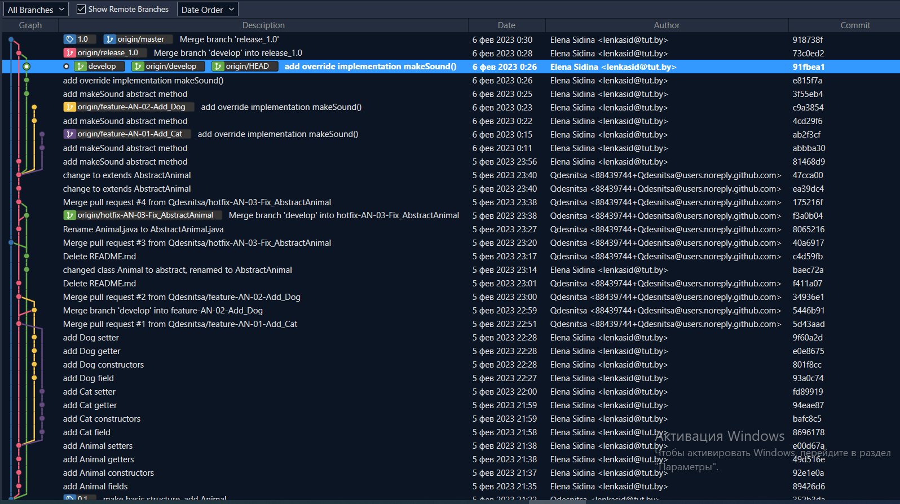

### Clevertec Task 01 Git Flow
***
1. git init
2. git config --local user.name "Elena Sidina"
3. git config --local user.email "lenkasid@tut.by"
4. git branch
5. git add .
6. git commit -m"add Animal"
7. git commit --amend -m"make basic structure, add Animal"
8. git checkout -b develop
9. git commit -a -m"add Animal fields"
10. git commit -a -m"add Animal constructors"
11. git commit -a -m"add Animal getters"
12. git commit -a -m"add Animal setters"
13. git checkout -b feature-AN-01-Add_Cat
14. git commit -a -m"add Cat field"
15. git commit -a -m"add Cat constructors"
16. git commit -a -m"add Cat getter"
17. git commit -a -m"add Cat setter"
18. git commit -a -m"add silly method"
19. git log
20. git reset --hard fd89
21. git diff 94ea
22. git checkout develop
23. git checkout -b feature-AN-02-Add_Dog
24. the same logic git commands with feature-AN-02-Add_Dog...
25. created remote repository on github.com
26. git remote add clevertec git@github.com:Qdesnitsa/Clevertec_Task_01.git
27. git push -u clevertec --all
28. actions on github.com:  
    New pull request  
    feature-AN-01-Add_Cat -> develop  
    Create pull request  
    Merge pull request  
    Confirm merge  
29. New pull request  
    feature-AN-02-Add_Dog -> develop  
    Resolve conflicts  
    Create pull request  
    Merge pull request  
    Confirm merge  
30. git checkout master
31. git tag 0.1
32. git push clevertec --tags
33. git checkout -b hotfix-AN-03-Fix_AbstractAnimal
34. git commit -a -m"changed class Animal to abstract, renamed to AbstractAnimal"
35. git push clevertec hotfix-AN-03-Fix_AbstractAnimal
36. actions on github.com:  
    New pull request  
    hotfix-AN-03-Fix_AbstractAnimal -> master  
    Create pull request  
    Merge pull request  
    Confirm merge  
37. actions on github.com:  
    New pull request  
    hotfix-AN-03-Fix_AbstractAnimal -> develop  
    Resolve conflicts  
    Create pull request  
    Merge pull request  
    Confirm merge  
38. git branch -r
39. git pull
40. git checkout -b release_1.0
41. git commit -a -m"add makeSound abstract method"
42. git log
43. git checkout feature-AN-01-Add_Cat
44. git merge develop
45. git cherry-pick 81468d9dd6607374a6831eda01d6a57f943c590d
46. git commit -a -m"add override implementation makeSound()"
47. git log
48. git checkout feature-AN-02-Add_Dog
49. git merge develop
50. git cherry-pick 81468d9dd6607374a6831eda01d6a57f943c590d
51. git commit -a -m"add override implementation makeSound()"
52. git log
53. git checkout develop
54. git cherry-pick 81468d9dd6607374a6831eda01d6a57f943c590d
55. git cherry-pick ab2f3cf6a6b7d50c3beac8550c23dcb7fdcebe39
56. git cherry-pick c9a38545c80f13719d11d5a67de0f03e7f4a4d49
57. git checkout release_1.0
58. git merge develop
59. git checkout master
60. git merge release_1.0
61. git push --all clevertec
62. git push clevertec --tags

